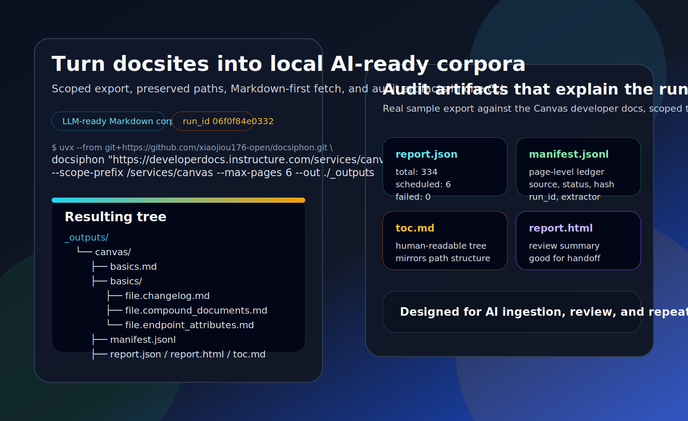
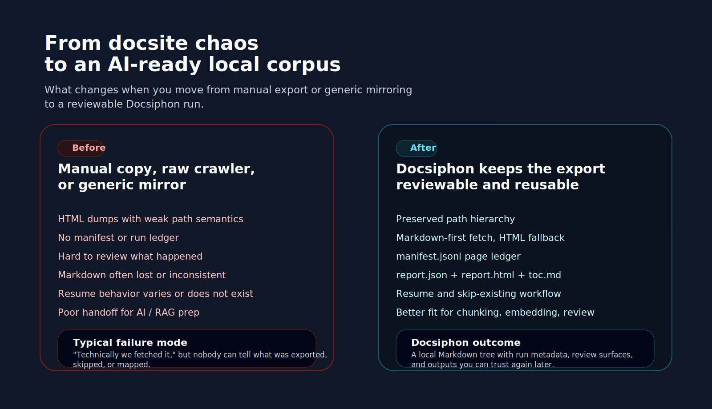
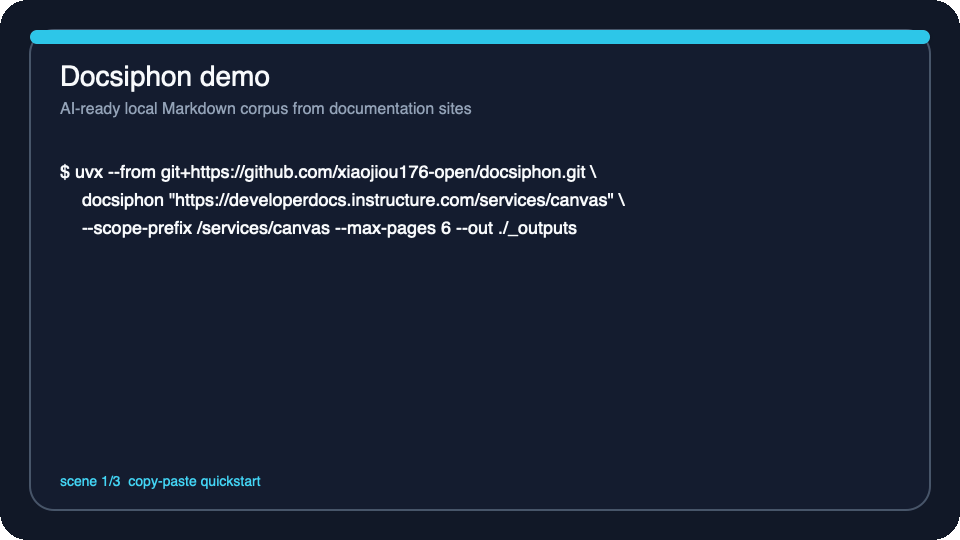

# Docsiphon

**Turn documentation sites into AI-ready local Markdown corpora with preserved
paths, reproducible exports, and audit artifacts.**

Docsiphon is a Python CLI for AI / RAG builders who need something better than
"just mirror the site and hope for the best." It keeps URL hierarchy intact,
prefers Markdown when the docsite exposes it, falls back to HTML extraction
when it does not, and writes a run ledger you can review, resume, or hand to
another operator.

**Best fit:** teams turning vendor docs into reviewable local Markdown corpora
for retrieval, eval, and offline documentation work.
**Not for:** fully generic website mirroring, JS-heavy browser automation, or
pixel-perfect site archiving.

[First Success](#first-success-in-one-command) · [Proof Ladder](#proof-ladder) · [Repo Map](./docs/README.md) · [Examples](./examples/README.md) · [Latest Release](https://github.com/xiaojiou176-open/docsiphon/releases/latest)



_What a first success looks like: a scoped export, a preserved file tree, and
audit artifacts you can hand to another operator._

[](https://github.com/xiaojiou176-open/docsiphon/releases/latest)
[](https://github.com/xiaojiou176-open/docsiphon/actions/workflows/ci.yml)
[](./LICENSE)

> If you build retrieval, eval, or offline doc pipelines, star this repo now.
> It is the kind of tool you do not need every day, but you will want to find
> instantly the next time a vendor docsite becomes your ingestion problem.

## First Success In One Command

If you only want to give Docsiphon 30 seconds, do not start with a wall of
explanation. Start with this:

```bash
uvx --from git+https://github.com/xiaojiou176-open/docsiphon.git \
  docsiphon "https://developerdocs.instructure.com/services/canvas" \
  --scope-prefix /services/canvas \
  --max-pages 6 \
  --out ./_outputs \
  --site-root auto
```

After the command finishes, you should see three concrete signals right away:

- `_outputs/canvas/` contains a Markdown tree that still follows source-path
  semantics
- `manifest.jsonl`, `report.json`, `toc.md`, and `report.html` are written as a
  reviewable audit bundle
- you can inspect one small but real documentation export without bringing in
  browser automation

> Think of this like testing a key before remodeling the whole lock.
> Confirm the door opens first, then decide whether you want the deeper
> mechanics.

For the longer explanation, copyable profiles, and troubleshooting path,
continue to [Quickstart](#quickstart).

## Proof Ladder

Do not treat every public asset in this repository as interchangeable. Each one
proves a different part of the story:

| Asset | What it proves | Best placement |
| --- | --- | --- |
| `docsiphon-hero.svg` | What the tool is | First screen |
| `docsiphon-before-after.svg` | Why it is worth trying over naive crawling | Below the fold / second screen |
| `docsiphon-demo.gif` | What a real local result looks like after the first run | Second screen |

## Why Docsiphon

- **Ship an LLM-ready corpus, not a pile of scraped HTML.** Docsiphon prefers
  Markdown twins when a docsite publishes them and only falls back to HTML
  conversion when needed.
- **Keep structure humans and pipelines can still reason about.** Exported files
  preserve path hierarchy instead of flattening everything into opaque blobs.
- **Keep an audit trail for every run.** `manifest.jsonl`, `report.json`,
  `toc.md`, and `report.html` make the export inspectable, resumable, and easy
  to review.

## Who It Is For

- AI / RAG builders preparing retrieval corpora from vendor documentation
- Teams that want a local, reviewable snapshot before chunking or embedding
- Operators who need reproducible doc exports with a ledger, not one-off copy
  and paste sessions

## Trade-offs / Not For

Docsiphon is a strong fit when the source is a documentation site and the goal
is to produce a clean local corpus.

It is **not** the right tool when:

- you need a universal website mirroring solution
- the site depends on heavy browser-side rendering or authenticated product UX
- you need to preserve every visual detail of a live site rather than extract
  structured, text-first content

## At A Glance

If you want a fast filter before reading deeper, start with this table:

| What you need to know | Current answer |
| --- | --- |
| Primary surface | `CLI-first` |
| Current flagship public packet | GitHub repo front door + `uvx` quickstart + release assets / example profiles |
| What success looks like | scoped export + preserved file tree + audit artifacts |
| What not to assume | This is not a universal website mirror or a browser-heavy product archiver |

## Current Product Boundary

- **Only current primary surface and front door today:** `CLI-first`
- **Current flagship public packet:** GitHub repo front door + `uvx` quickstart + release assets / example profiles
- **Future secondary surface only:** MCP-aware secondary surface is allowed later, but it stays **future secondary** until it ships its own install contract, verification gate, public packet, and lane truth
- **Current start path:** stay on this README + the `uvx` quickstart below before treating any future secondary surface as part of the public flagship path

Put more plainly:

> Docsiphon can grow an MCP-aware secondary surface later.
> Today, the front door is still the CLI, and any new secondary surface must
> earn its own install contract, verification gate, public packet, and lane
> truth.

## Quickstart

### Fastest Way To Try It

You only need two things for the default first run:

1. install [`uv`](https://docs.astral.sh/uv/getting-started/installation/)
2. copy the command below and let Docsiphon export a small, scoped sample

```bash
uvx --from git+https://github.com/xiaojiou176-open/docsiphon.git \
  docsiphon "https://developerdocs.instructure.com/services/canvas" \
  --scope-prefix /services/canvas \
  --max-pages 6 \
  --out ./_outputs \
  --site-root auto
```

This first run is intentionally small. It proves the path-preserving export,
the report artifacts, and the Markdown-first fetch path without asking you to
mirror an entire vendor docsite.

If `uv` is not installed yet, start here:
[Installing uv](https://docs.astral.sh/uv/getting-started/installation/).
If you want a prefilled profile instead of flags, use the release assets under
[`examples/README.md`](./examples/README.md).

## Why It Beats Naive Crawling



_The point of this comparison is simple: Docsiphon is trying to give you a
local corpus you can trust later, not just a pile of fetched bytes._

| Approach | Preserves path hierarchy | Prefers Markdown | Emits audit artifacts | Resume support | Filtering and scope controls | LLM ingestion friendliness |
| --- | --- | --- | --- | --- | --- | --- |
| Manual copy / paste | No | Sometimes | No | No | No | Low |
| Raw crawler | Rarely | No | Rarely | Rarely | Varies | Medium |
| Generic site mirror | Sometimes | No | No | Rarely | Medium | Medium |
| **Docsiphon** | **Yes** | **Yes** | **Yes** | **Yes** | **Yes** | **High** |

Docsiphon is not trying to be a universal web archiver. It is opinionated about
one job: turning documentation sites into clean local assets that are easier for
AI systems and humans to inspect.

### Copyable Profiles Without a Checkout

If you want a first run with less flag typing after the default path works,
download one of the current `v0.1.1` release assets first:

- [canvas-quickstart.toml](https://github.com/xiaojiou176-open/docsiphon/releases/download/v0.1.1/canvas-quickstart.toml)
- [rag-corpus.toml](https://github.com/xiaojiou176-open/docsiphon/releases/download/v0.1.1/rag-corpus.toml)
- [strict-audit.toml](https://github.com/xiaojiou176-open/docsiphon/releases/download/v0.1.1/strict-audit.toml)

Then run Docsiphon with the profile you downloaded:

```bash
uvx --from git+https://github.com/xiaojiou176-open/docsiphon.git \
  docsiphon "https://developerdocs.instructure.com/services/canvas" \
  --profile ./canvas-quickstart.toml
```

## Release Shelf Truth

Use the latest release entrypoint when you want the newest **published**
artifact shelf:

- tagged wheel / sdist builds
- downloadable starter profiles
- release notes for the current published cut

Use the README and Pages docs when you want the newest **repository**
truth on `main`:

- current front-door wording
- current governance and docs contracts
- the latest Pages routing surface

These are related, but they are not the same shelf. A future `main` commit can
move the docs, governance, or Pages truth forward before a new tagged release
is cut.

### If The First Run Does Not Work

- Need the full repository map and support boundary? Start with
  [`docs/README.md`](./docs/README.md)
- Want copyable profile examples? Jump to [`examples/README.md`](./examples/README.md)
- Need the contributor workflow instead of the end-user path? Use
  [`CONTRIBUTING.md`](./CONTRIBUTING.md)

## Common Commands

Dry-run discovery before downloading content:

```bash
uvx --from git+https://github.com/xiaojiou176-open/docsiphon.git \
  docsiphon "https://developerdocs.instructure.com/services/canvas" \
  --scope-prefix /services/canvas \
  --dry-run
```

Scoped crawl against a docs subtree:

```bash
uvx --from git+https://github.com/xiaojiou176-open/docsiphon.git \
  docsiphon "https://example.com/docs/start" \
  --scope-prefix /docs \
  --max-pages 500
```

Resume an existing export:

```bash
uvx --from git+https://github.com/xiaojiou176-open/docsiphon.git \
  docsiphon "https://example.com/docs/start" \
  --resume \
  --skip-existing
```

Use a profile file:

```bash
uvx --from git+https://github.com/xiaojiou176-open/docsiphon.git \
  docsiphon "https://example.com/docs/start" \
  --profile ./examples/rag-corpus.toml
```

## What You Get

Each non-dry run writes:

- exported Markdown or saved HTML files
- `manifest.jsonl` as the page-level ledger
- `report.json` as the run summary
- `index.json`, `toc.md`, and `report.html` as derived views
- `_errors/` snapshots when error sampling is enabled

## Real Example Output



_The demo below is not a generic animation. It is showing the exact kind of
small first success the README is asking you to reproduce._

The snapshot below comes from a real sample run against the Canvas developer
docs with `--scope-prefix /services/canvas --max-pages 6`.

```text
_outputs/
└── canvas/
    ├── basics.md
    ├── basics/
    │   ├── file.changelog.md
    │   ├── file.compound_documents.md
    │   ├── file.endpoint_attributes.md
    │   └── file.file_uploads.md
    ├── canvas.md
    ├── index.json
    ├── manifest.jsonl
    ├── report.html
    ├── report.json
    ├── toc.md
    └── urls.txt
```

```json
{
  "run_id": "7477bdf950af",
  "discovery_source": "sitemap",
  "total": 336,
  "scheduled_urls": 6,
  "ok": 6,
  "failed": 0,
  "path_collisions": 0
}
```

The exported Markdown preserves path semantics instead of flattening everything
into generic filenames:

```md
---
source_url: https://developerdocs.instructure.com/services/canvas/basics
fetched_url: https://developerdocs.instructure.com/services/canvas/basics.md
---
# Basics

- [GraphQL](/services/canvas/basics/file.graphql.md)
- [API Change Log](/services/canvas/basics/file.changelog.md)
- [Pagination](/services/canvas/basics/file.pagination.md)
```

## Use Cases for AI / RAG

- Build a clean retrieval corpus before chunking and embedding vendor docs
- Snapshot third-party documentation into a reviewable tree for eval or audit
- Keep an offline Markdown mirror with a ledger you can diff, resume, and rerun

## Evidence Snapshot

This is the section for people evaluating whether Docsiphon is merely
well-written or actually grounded in runnable evidence.

| Surface | Current public evidence | How to reproduce it | Why it matters |
| --- | --- | --- | --- |
| Markdown twin docsites | `scripts/verify_instructure.sh` currently confirms `200 text/markdown` responses for both the Canvas root page and a nested subpage | `bash scripts/verify_instructure.sh` | Proves the Markdown-first path is real on a public vendor docsite |
| Sitemap-scoped export | A fresh sample run discovered `336` URLs through sitemap, scheduled `6`, wrote `6`, and failed `0` under `--scope-prefix /services/canvas --max-pages 6` | `uv run docsiphon "https://developerdocs.instructure.com/services/canvas" --scope-prefix /services/canvas --max-pages 6 --out /tmp/docsiphon-sample --site-root auto` | Shows the "small first success" story is not hypothetical |
| Discovery coverage | The current engine covers `llms.txt`, sitemap, search index, and BFS fallback in code and automated tests | `uv run pytest tests/test_discovery.py tests/test_discovery_more.py` | Explains why Docsiphon is more than a single-site probe |
| Audit artifacts | `manifest.jsonl`, `report.json`, `index.json`, `toc.md`, `report.html`, and sampled `_errors/` snapshots all have dedicated test coverage | `uv run pytest tests/test_report.py tests/test_storage.py tests/test_cli_run.py` | This is the part generic mirrors usually do not give you |
| Release assets and copyable profiles | The latest public release ships hero/demo/social-preview assets plus downloadable starter profiles | [Release v0.1.1](https://github.com/xiaojiou176-open/docsiphon/releases/tag/v0.1.1) | Lets evaluators try the repo without reverse-engineering local setup |

Evidence refreshed from a local verification run on `2026-03-26`.

## What's Next

Docsiphon already covers the core export loop, but the near-term public focus is
clear:

- expand compatibility with more real-world documentation site shapes through
  the docs-site compatibility intake path
- keep tightening the public example profiles so first-time users can move from
  README to a successful export faster
- keep improving the review and artifact story around `manifest.jsonl`,
  `report.json`, `report.html`, and `toc.md`

If you want a vote in what gets optimized next, the most useful entrypoint is
the repo-local roadmap and the live GitHub issues / discussions indexes:

- Repo roadmap: `docs/roadmap.md`
- Roadmap issue queue:
  `https://github.com/xiaojiou176-open/docsiphon/issues?q=is%3Aissue+is%3Aopen+label%3Aroadmap`
- Discussions index:
  `https://github.com/xiaojiou176-open/docsiphon/discussions`
- Current roadmap themes:
  - expand docs-site compatibility coverage
  - strengthen public example profiles
  - improve audit artifact review surfaces

## Community Pulse

Docsiphon keeps a few public threads active so the repository does not feel
like a one-shot dump:

- Discussions home:
  `https://github.com/xiaojiou176-open/docsiphon/discussions`
- Categories to look for there:
  - Announcements for release highlights
  - Q&A for first-run blockers
  - Ideas for docsite requests and workflow proposals
  - Show and Tell for real exported corpora

If you use Docsiphon on a real documentation stack, the most useful thing you
can share is the command you ran, the target docs surface, and a short
`report.json` excerpt.

## Why Not Just `wget` or a Generic Crawler?

Because the hard part is not fetching bytes. The hard part is getting a local
result that still feels like documentation, still maps back to source URLs, and
still leaves behind enough run evidence that you can trust what happened.

Generic crawlers are like dumping a filing cabinet onto the floor and saying
"technically, everything is here." Docsiphon is trying to put the papers into a
folder structure you can actually use again.

## How It Works

Docsiphon follows a CLI-driven export pipeline:

1. parse CLI arguments and optional profile settings
2. discover candidate URLs through `llms.txt`, sitemap, search index, or BFS
3. filter and normalize the candidate set
4. export each page through Markdown-first fetch with HTML fallback
5. write page artifacts and derived run artifacts

## Verification

### Verification / Trust

This repository keeps a thin public docs surface, but the trust boundary is
real:

- the CLI entrypoint is checked in CI
- repository contracts and hygiene gates are enforced
- tests cover the current documented behavior
- export runs produce reproducible operator artifacts instead of silent side
  effects

Current verification entrypoints:

See [`CONTRIBUTING.md`](./CONTRIBUTING.md) for the full contributor verification
commands and the canonical local cleanup path.

## Local Cleanup Contract

Docsiphon already ships a repo-local cleanup path for rebuildable noise:

```bash
uv run python scripts/clean_local_state.py
uv run python scripts/clean_local_state.py --apply
```

Current boundary:

- the script above is the default repo-local cleanup lane today
- `build/`, `htmlcov/`, `*.egg-info/`, `__pycache__/`, `.pytest_cache/`, and
  `.runtime-cache/temp/` are disposable local noise
- `.venv/` is a rebuildable local environment, but it is intentionally **not**
  part of `clean_local_state.py`
- `_outputs/` remains operator data and is intentionally excluded from cleanup

This repository does not define a repo-owned Docker cleanup lane today, and the
cleanup contract above should be read as repo-local only.

## Documentation

The public docs surface stays intentionally thin and high-signal.

- Repository map, execution model, and support boundary: `docs/README.md`
- GitHub Pages landing page: `docs/index.md`
- GitHub Pages repo map: `docs/repo-map.md`
- Latest public release: `https://github.com/xiaojiou176-open/docsiphon/releases/latest`
- Release body source for `v0.1.1`: `.github/release-body-v0.1.1.md`
- GitHub social preview source file for repository settings:
  `assets/docsiphon-social-preview.png`
- Citation metadata: `CITATION.cff`
- Copyable profile examples: `examples/README.md`
- Downloadable example profile assets also ship on the latest release page
- Contribution workflow: `CONTRIBUTING.md`
- Security reporting: `SECURITY.md`
- Support policy: `SUPPORT.md`

## Collaboration

- `CODEOWNERS` defines the review routing baseline
- PR and Issue templates are part of the live repository contract
- Current roadmap themes live in `docs/roadmap.md`
- GitHub Discussions remains the community front door:
  `https://github.com/xiaojiou176-open/docsiphon/discussions`
- Generated outputs, caches, runtime state, and local editor files stay out of Git

## Development Environment

A minimal DevContainer is available under `.devcontainer/` for contributors who
prefer a containerized Python 3.11 + `uv` workflow.

## FAQ

### Does Docsiphon require a full checkout and local setup?

No. The public-first path is `uvx --from git+https://github.com/xiaojiou176-open/docsiphon.git ...`.
Use the contributor workflow only if you plan to hack on the repository itself.

### Does it only work on sites that publish Markdown?

No. Docsiphon prefers Markdown when available, but it can fall back to HTML
fetch and extraction when the source site does not expose a Markdown twin.

### Is this a general browser automation crawler?

No. Docsiphon is optimized for documentation exports, not arbitrary product
surfaces that need a headless browser to render authenticated UI flows.

## Security

Use the process described in `SECURITY.md` for vulnerabilities or accidental
secret exposure. Do **not** post sensitive details in public issues.

## Contributing

See `CONTRIBUTING.md` for setup, validation, and pull-request expectations.

## License

Docsiphon is released under the MIT License. See `LICENSE`.
